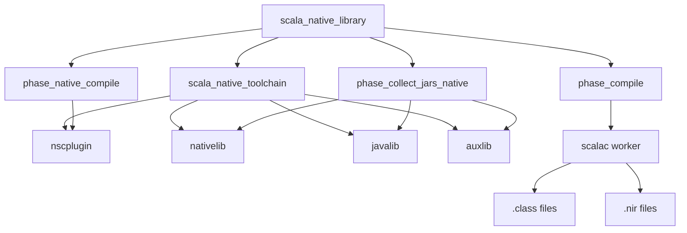

# Scala Native Integration - Architecture & Usage Documentation

## Overview

This document describes the Scala Native NIR (Native Intermediate Representation) generation support
in [rules_scala](https://registry.bazel.build/modules/rules_scala).
This integration enables compiling Scala code to NIR files, which is the first phase of Scala Native compilation.

**Current Status**: ✅ Phase 1 Complete - NIR Generation  
**Supported**: Scala 3.8.1 with Scala Native 0.5.10  
**Platform**: Linux x86_64, Bazel 9+

## Architecture

### Component Overview



### Key Components

#### 1. Toolchain (`scala_native_toolchain`)

**Purpose**: Provides version-specific Scala Native dependencies with proper repository visibility.

**Location**: [scala_native/scala_native_toolchain.bzl](../../scala_native/scala_native_toolchain.bzl)

**Provides**:
- `nscplugin` - Compiler plugin for NIR generation
- `scalalib` - Scala Native standard library  
- `nativelib` - Core Native APIs (`scala.scalanative.unsafe`, etc.)
- `javalib` - Java compatibility layer
- `auxlib` - Auxiliary library

**Why Toolchain?**  
Bzlmod repository visibility rules prevent direct references to versioned repositories from rule implementations. Toolchains solve this by providing dependencies with correct visibility across module boundaries.

#### 2. Compilation Phases

##### `phase_native_compile`

**Purpose**: Injects nscplugin into the compilation process.

**Location**: [scala_native/private/phases/phase_native_compile.bzl](../../scala_native/private/phases/phase_native_compile.bzl)

**How it works**:
```python
return struct(
    scalacopts = [],
    plugin = [toolchain.nscplugin],  # Scalac worker converts to -Xplugin
)
```

The scalac worker automatically converts the `plugin` field to `-Xplugin` arguments, avoiding manual flag management.

##### `phase_collect_jars_native`

**Purpose**: Adds Scala Native runtime libraries to compilation classpath.

**Location**: [scala_native/private/rules/scala_native_library.bzl](../../scala_native/private/rules/scala_native_library.bzl#L64-L100)

**How it works**:
```python
scala_native_toolchain = ctx.toolchains["//scala_native:toolchain_type"]

all_deps = ctx.attr.deps + [
    scala_native_toolchain.nativelib,  # Contains scala.scalanative.unsafe
    scala_native_toolchain.javalib,
    scala_native_toolchain.auxlib,
] + p.scalac_provider.default_classpath
```

These runtime libraries provide the types and methods (`extern`, `Ptr[T]`, etc.) that nscplugin needs during compilation.

##### Core `phase_compile` Integration

**Location**: [scala/private/phases/phase_compile.bzl](../../scala/private/phases/phase_compile.bzl#L128-L136)

The core compile phase was modified to recognize `native_compile` phase data:

```python
if (hasattr(p, "native_compile")):
    scalacopts += p.native_compile.scalacopts
    plugins = plugins + p.native_compile.plugin
```

This follows the same pattern as `semanticdb` integration, ensuring clean architecture.

#### 3. Rule Implementation (`scala_native_library`)

**Location**: [scala_native/private/rules/scala_native_library.bzl](../../scala_native/private/rules/scala_native_library.bzl)

**Phase Execution Order**:
1. `scalac_provider` - Set up Scala compilation context
2. `dependency` - Analyze dependencies
3. **`collect_jars`** - Add runtime libraries to classpath
4. **`native_compile`** - Inject nscplugin
5. `compile` - Run Scala compilation (generates .class + .nir)
6. `scala_native_info` - Create ScalaNativeInfo provider

### Dependency Management

```
┌────────────────────────────────────────────┐
│ Bazel Module (bzlmod)                      │
│                                            │
│ ┌──────────────────────────────────────┐   │
│ │ @rules_scala++scala_deps+            │   │
│ │                                      │   │
│ │ ├─ org_scala_native_nscplugin_3_8_1  │   │
│ │ ├─ org_scala_native_nativelib_3_8_1  │   │
│ │ ├─ org_scala_native_javalib_3_8_1    │   │
│ │ └─ org_scala_native_auxlib_3_8_1     │   │
│ └──────────────────────────────────────┘   │
│              ↓                             │
│ ┌──────────────────────────────────────┐   │
│ │ scala_native_toolchain               │   │  
│ │ (provides visibility to deps)        │   │
│ └──────────────────────────────────────┘   │
│              ↓                             │
│ ┌──────────────────────────────────────┐   │
│ │ scala_native_library                 │   │
│ │ (accesses deps via toolchain)        │   │
│ └──────────────────────────────────────┘   │
└────────────────────────────────────────────┘
```

## Design Decisions

### 1. Toolchain-Provided Dependencies

**Decision**: Runtime libraries (nativelib, javalib, auxlib) are provided through the toolchain, not as implicit rule dependencies.

**Rationale**:
- **Bzlmod Visibility**: Direct repository references (`@org_scala_native_nativelib//jar`) from rule implementations fail with bzlmod due to visibility restrictions
- **Version Management**: Toolchains handle version-specific repository resolution automatically
- **Consistency**: Matches how nscplugin is provided
- **Future-Proof**: Scales to supporting multiple Scala Native versions

**Alternative Considered**: Implicit dependencies with `attr.label(default = "@org_scala_native_nativelib//jar")`  
**Why Rejected**: Repository visibility errors in bzlmod

### 2. Phase Integration Pattern

**Decision**: Modified core [phase_compile.bzl](../../scala/private/phases/phase_compile.bzl) to natively support `native_compile` phase data.

**Rationale**:
- **Clean Architecture**: Follows established `semanticdb` pattern
- **Forward Compatible**: Easy to extend for other compiler plugins

**Alternative Considered**: Wrapper phase that renames itself to override standard compile  
**Why Rejected**: Fragile, difficult to maintain, breaks assumptions

### 3. Plugin Injection Mechanism

**Decision**: Return plugin in phase struct; let scalac worker handle `-Xplugin` flag generation.

**Rationale**:
- **Consistency**: Follows rules_scala conventions
- **Simplicity**: No manual flag management
- **Reliability**: Worker knows correct flag format

**Alternative Considered**: Manually add `-Xplugin:path/to/plugin.jar` to scalacopts  
**Why Rejected**: More error-prone, duplicates worker logic

### 4. Artifact Repository Structure

**Decision**: Added Scala Native artifacts to existing [scala_3_8.bzl](../../third_party/repositories/scala_3_8.bzl) artifact list.

**Rationale**:
- **Centralized Management**: All Scala 3.8.1 artifacts in one place
- **Consistent Versioning**: Scala Native version tied to Scala version
- **Reuse Infrastructure**: Leverages existing artifact management

## Trade-offs

### Current Limitations

| Limitation | Impact | Mitigation |
|-----------|---------|------------|
| **Scala 3.8.1 Only** | Can't use other Scala 3 versions | Add artifacts to scala_3_x.bzl for each version |
| **No Native Linking** | Can't produce executables | Phase 2: implement `scala_native_binary` rule |
| **Fixed Scala Native 0.5.10** | Can't use other SN versions | Add version parameter to toolchain |
| **Linux x86_64 Only** | Platform-specific | Add multi-platform support in linker phase |

### Performance Considerations

**Compilation Time**:
- **Plugin Overhead**: Slower than regular Scala compilation due to extra phases.
- **NIR Generation**: O(n) with source file count
- **Acceptable**: For most projects, impact is negligible

**Build Graph**:
- **Additional Dependencies**: 4 new runtime library dependencies
- **Artifact Download**: One-time cost, ~5MB total
- **Caching**: Bazel caches all artifacts

### Design Trade-offs

#### ✅ Pros
- **Clean Architecture**: Integrates naturally with rules_scala phase system
- **Type Safety**: Full Scala Native type checking during compilation
- **Incremental**: Works with Bazel's incremental compilation
- **Maintainable**: Follows established patterns

#### ⚠️ Cons
- **Two-Phase Build**: NIR → native binary requires separate linking step (Phase 2)
- **Version Coupling**: Scala Native version tied to Scala version
- **Platform Specific**: Artifacts are platform-dependent

## Usage

### Basic Example

```python
load(
    "@rules_scala//scala_native/private/rules:scala_native_library.bzl",
    "scala_native_library",
)

scala_native_library(
    name = "my_native_lib",
    srcs = ["Main.scala"],
    deps = [
        # Standard Scala dependencies work
        "//some/other:library",
    ],
)
```

### Scala Code Example

```scala
package examples.native

import scala.scalanative.unsafe._
import scala.scalanative.unsigned._

@extern object stdlib:
  def malloc(size: CSize): Ptr[Byte] = extern

val ptr = stdlib.malloc(32.toCSize)
```

### Verifying NIR Generation

```bash
# Build the target
bazel build //path/to:my_native_lib

# Verify NIR files in output JAR
jar tf bazel-bin/path/to/my_native_lib.jar | grep '\.nir$'

# Example output:
# example/hello$.nir
# example/hello.nir
```

### Integration with Existing Scala Code

```python
scala_library(
    name = "shared_code",
    srcs = ["Utils.scala"],
)

scala_native_library(
    name = "native_app",
    srcs = ["Main.scala"],
    deps = [
        ":shared_code",  # Regular scala_library deps work
    ],
)
```

### Toolchain Configuration

The toolchain is automatically registered. For custom configurations:

```python
# In your MODULE.bazel
scala_deps.scala_native()  # Auto-registers default toolchain

# Custom toolchain (advanced)
scala_native_toolchain(
    name = "custom_sn_toolchain",
    nscplugin = "@org_scala_native_nscplugin//jar",
    nativelib = "@org_scala_native_nativelib//jar",
    javalib = "@org_scala_native_javalib//jar",
    auxlib = "@org_scala_native_auxlib//jar",
    scala_native_version = "0.5.10",
)
```

## Troubleshooting

### "No repository visible as '@org_scala_native_*'"

**Cause**: Repository visibility issue in bzlmod.

**Solution**: Ensure `scala_deps.scala_native()` is called in your MODULE.bazel

```python
scala_deps = use_extension(
    "@rules_scala//scala/extensions:deps.bzl",
    "scala_deps",
)
scala_deps.scala()
scala_deps.scala_native()  # ← Required
```

### No NIR Files Generated

**Symptoms**: Only `.class` files in output JAR, no `.nir` files.

**Debugging**:
```bash
# Check if nscplugin is in classpath
cat bazel-bin/your_target.jar-0.params | grep -A5 "^--Plugins"

# Should show:
# external/.../org_scala_native_nscplugin_3_8_1/nscplugin_3.8.1-0.5.10.jar
```

**Common Causes**:
1. Scala Native toolchain not registered
2. Wrong Scala version (must be 3.8.1)
3. Plugin not being injected (check `phase_native_compile`)

### Compilation Errors: "package scala.scalanative.unsafe does not have a member..."

**Cause**: Runtime libraries not on classpath.

**Solution**: Verify toolchain provides runtime libs:
```bash
# Check runtime libs in classpath
cat bazel-bin/your_target.jar-0.params | grep -A10 "^--Classpath"

# Should include:
# .../org_scala_native_nativelib_3_8_1/...
# .../org_scala_native_javalib_3_8_1/...
# .../org_scala_native_auxlib_3_8_1/...
```

## Future Roadmap

### Phase 2: Native Linking (Planned)

```python
scala_native_binary(
    name = "native_app",
    deps = [":my_native_lib"],
    main_class = "example.Main",
    # Will invoke Scala Native linker to produce executable
)
```

**Components Needed**:
1. Scala Native linker integration
2. Clang/LLVM toolchain configuration
3. Native library linking (libc, etc.)
4. Multi-platform support

### Multi-Version Support

- Add artifacts for Scala 3.1-3.7
- Support multiple Scala Native versions (0.4.x, 0.5.x)
- Version compatibility matrix

### Performance Optimizations

- Persistent worker for NIR generation
- Incremental NIR compilation
- Parallel linking

## References

- [Scala Native Documentation](https://scala-native.org/)
- [rules_scala Architecture](https://github.com/bazelbuild/rules_scala/blob/master/docs/scala.md)
- [Bazel Toolchains](https://bazel.build/extending/toolchains)
